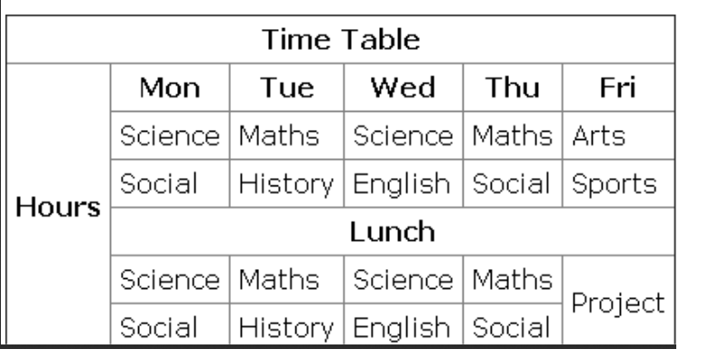
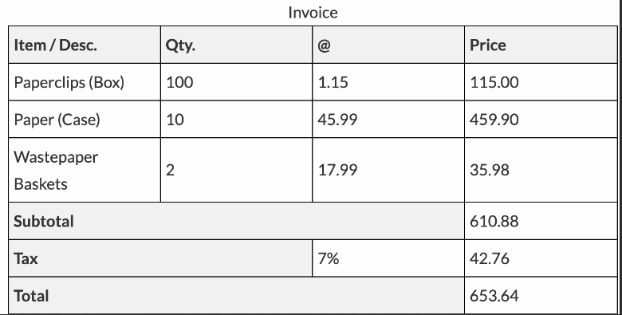

1. 
Gör en tabell enligt nedan:

2. 
Gör en tabel enligt nedan:

3. \
Style din presentation som du gjorde tidigare
- Skapa en ny fil i samma mapp och döp den till style.css
- Importera in css-filen i html-dokumentet.

Exempel på det du kan göra:
- Använd det ni vill eller gör något helt eget
- Centrera alla rubriker
- Byt färg på alla texter
- Lägg till en bakgrundsbild på sidan
- Styla en knapp olika beroende på tillstånd (hover, active)
- Vänster-justera en text
- Gör en bild rund
- Lägg två boxar (div:ar) bredvid varandra
- Gör en punkt-lista med cirklar
- Använd en annan font för rubriker
- Byt färg på länkar
- Ändra storleken på paragrafer

4. \
Yatzy
Skapa klasser och struktur för att efterlikna eller liknande formulär. Lägg märke till hur de använder färger för at skilja på spelar-kolumner, summeringar mm.
Sätt lämplig bredd på input-fält.