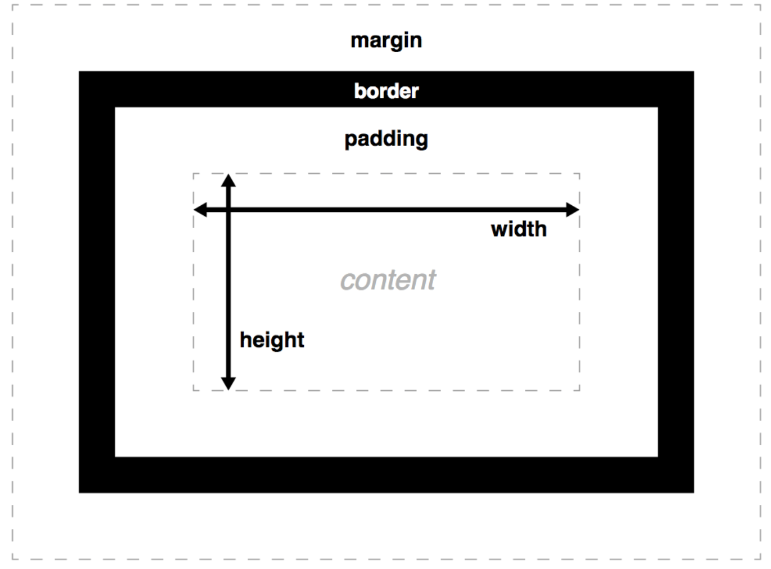

# HTML

## Charset
Det finns flera olika charset

- ASCII
- ANSI 
- 8859 
- UTF-8

För att definera vilket charset som sidan är skriven på så kan man använda sig av meta data

````HTML
<meta charset="UTF-8">
````
Bra att känna till är att alla fonter inte har alla specialtecken.

https://www.w3schools.com/html/html_charset.htm

## index.html

Vanligtvis serveras filer av en webbserver. 
- Apache
- nginx
- ligthtpd
- IIS
- NodeJS

Webbservarar kan konfigureras på olika sätt. Det är vanlgit att index.html är en speciell fil.

## Dokumentation

Mozilla: https://developer.mozilla.org/sv-SE/docs/Web

## HTML-element
Att styra utseendet med html är ett big no-no.
Ex.
- \<Strong>
- \<em>

För att kapsla in data så använder man oftast följande:
- div
- span

Div använder man oftast  när man vill kapsla in ett helt block. Div taggen gör en radbrytning i din text. Div används för att bygga upp olika delar av webbplatsen. ex för Sidpanel, navigation, content.

Span använder man oftast när man vill ändra utseendet för en specifik text. Span taggen som standard ändrar inte texten.

Det finns flera element:
- article
- navigation
- section

## HTML formulär

Formulär kan användas för att kunna kommunicera med javascript samt servern.

För att kunna hantera information som skickas från besökaren så behövs ett programmeringsspråk som tolkar det vi skickat. Ex. PHP, C#, Java eller nodeJS. (Finns mycket mer språk att ta upp, men dessa är vanligaste språken).

### Säkerhet
Lita aldrig på något användaren skickar.
Rensar / Säkra datan som tas emot. Kommer tillaka till det senare i utbildning.

### Exempel på formulär

````HTML
<form method="POST" action="some_php.php"> <!-- method är ett attribut som betyder att den ska skicka data med hjälp av POST. Action, är vilken fil som ska ta emot POST-requesten -->
    Namn: <br>
    <input type="text" id="name" placeholder="Skriv ditt namn här"> <br> <!-- input skapar en ruta. type berättar att det är en text som skall lämnas. placeholder skriver ut en text som visas" -->

    Ålder: <br>
    <select id="age"> <!-- Detta är en dropdown meny -->
        <option value="age_group1">0-30</option>
        <option value="age_group2">30-60</option>
        <option value="age_group3">60-</option>
    </select> <br>

    Intressen: <br> <!-- detta är kryssrutor -->
    <input type="checkbox" name="hobbies" value="fotboll">Fotboll<br>

    Favorit-färg: <br> <!-- Dessa är val alternativ -->
    <input type="radio" name="color" value="red">Röd <br>
    <input type="radio" name="color" value="yellow">gul <br>
    
    <!--En ruta som bara innehåller nummer där användaren kan bläddra -->
    <input type="number" min="0" max="200" step="2"> <br>

    <!-- En ruta som validerar Email -->
    <input type="email"> <br>

    <!-- en ruta som validerar URL:er -->
    <input type="url"> <br>

    <input type="color"> <br>

    <!-- En knapp som skickar all data när submit-->
    <input type="submit">
</form>
````

## Tabeller

Du kan bygga tabeller med hjälp av följande taggar:
- table - definierar tabellen - *Denna krävs*
- thead - table head - *Inte nödvändig*
- tbody - table body - *Inte nödvändig*
- tfoot - table footer - *Inte nödvändig*
- tr - table row  - *Denna krävs*
- th - table header - *Inte nödvändig*
- td - table data - *Denna krävs*

````HTML
<table>    
    <thead>
    <tr>
        <th>Namn</th>
        <th>Ålder</th>
    </tr>
    </thead>
    
    </tbody>
    <tr>
        <td>Stephan</td>
        <td>27</td>
    </tr>
    </tbody>

    </tfoot>
        <tr>
            <td>Summa:</td>
            <td>27</td>
        </tr>
    </tfoot>

</table>
````

Du kan även göra så att celler går över flera rader och kolumner genom att sätta följande attribut i \<td> fältet
- colspan - antal kolummer som cellen går över \
- rowspan - antal rader som cellen går över

Exempel:

````HTML
<table>
    <tr>
        <td colspan="2">Denna tar upp två kolumner</td>
    </tr>
    <tr>
        <td rowspan="2">Denna tar upp två rader, men inte två kolumner</td>
        <td>Detta är bara en vanlig cell</td>
    </tr>
    <tr>
        <td>Denna cell kommer automatiskt hamna till vänster</td>
    </tr>
    <tr>
        <td colspan="2" rowspan="2">Denna cell tar 2 rader och två kolumner</td>
    </tr>
    <tr>
        <td> En cell</td>
        <td> Ännu en cell</td>
    </tr>
</table>
````

## Entities
Entities är specialtecken och det är för att vara säker på att det visas korrekt eller om de saknas på tangentbordet.

- Startar med *&* och avslutas med *;*
    - \&nbsp; - No breaking space 

# **CSS**

## Vad är CSS
CSS står för Cacading Style Sheets
Det är ett språk som beskriver presentationsstilen för ett struktuerat dokument som tll exempel typsnitt, textstorlek och färg.\
Css 

## Hur fungerar CSS
 Css kan skriva på tre sätt:
- Inline
````HTML
<p style="color:blue;">
Detta är blå text
</p>
````
- Head 
````HTML
<html>
    <head>
        <style>
            p {
                color:blue;
            }
        </style>
    </head>
</html>
````
- Extern \
Vilket innebär att du har all information i en CSS fil. Denna metod är att föredra.
````html
<head>
    <link href="style.css" rel="stylesheet">
<head>
````

Exempel på CSS-innehåll i en fil
````css
h1 {
    color: red;
}

p {
    background-color
}
````

### Färger
Det finns två sätt att ange färger på.
- Namngivna färger, ex. white, blue osv.
- Man anger RGB-värdet på hexadecimal form. Det innebär att man anger hur mycket rött man vill ha från 00 til FF, hur mycket grönt och hur mycket blått. ex: **#8C00FF** (Där 8C är hur mycket rött, 00 är hur mycket grönt och FF hur mycket blått det är).

## Class och ID
Det finns två specialla attribut som man kan ändra styles på.

- ID är unikt per element, det kan inte finnas flera p-element som ahr samma id, men det kan finnas ett p-element och ett div-element
  - i praktiken så kan man bara välja ett id per gång per sida.
  - id ska användas med försiktighet eftersom det kopllar struktur och presentation tight.

För att använda classer så använder du dig av punkt följt av ett namn du önskar. ex.
````css
.redtext {
    color: red;
}
````
För att använda ID:n så använder du dig av hashtag följt av ett namn du önskar. 
````css
#redtext {
    color: red;
}
````

## Prioriteringsregler
- Element-selektorer är värda 1 poäng (dvs p, div)
- class selektorer är värda 10 poäng (.)
- id-selektorer är värda 100 poäng (#)

Om ett element har flera classer med samma formatering, så kommer den sista formateringen att väljas.

````html
<style>
    p {
        color: green;
    }
    p {
        color: red;
    }
</style>

<p>This is a red text</p>

## States
Det finns flera stats. Exempelvis:
- hover (visar en css när du håller musen över objektet)
- focus (När en input ruta markeras)
- activ (När jag precis trycker på elementet)
- visted (Om länken är besökt)
````

## ge flerselektorer samma egenskaper

````html
<style>
    p.ingress, button {
        color: green;
        border-width: 1px;
    }
</style>
````

## Nästla 
Det går att nästla styles, så att en specifik element blir påverkad beroende på var 
````html
<style>
.info button { /* Endast knappen under div klassen info kommer bli blå */
        color: blue;
}
</style>

<div class="info">
    <button>Knapp</button>
</div>

<div class="something">
    <button>Knapp</button>
</div>
````
Det fungerar också att ärva klassen från en ovan element ex.
````html
<style>
.info button {
        color: blue;
}
</style>

<div class="info">
    <div>
        <button>Knapp</button>
    </div>
</div>

````

Det går även att tvinga att endast den som är förälder som man ska kolla på. Det gör man med hjälp av tecknet **>** mellan classen och taggen.

````html
<style>
.info > button { /* Se skillnaden */
        color: blue;
}
</style>

<div class="info">
    <div>
        <button>Knapp</button> <!-- Denna knapp blir inte blå-->
    </div>
    <button>Knapp</button> <!-- Denna knapp blir blå -->
</div>
````

## Styla tabeller

````html
<style>
tr:nth-child(even) {
    background-color: lightgrey;
}
tr:nth-child(odd) {
    background-color: yellow;
}
</style>
<table>
    <tr>
        <td>Lorem ipsum 1 </td>
    </tr>
    <tr>
        <td>Lorem ipsum 2 </td>
    </tr>
    <tr>
        <td>Lorem ipsum 3 </td>
    </tr>
    <tr>
        <td>Lorem ipsum 4 </td>
    </tr>
</table>
````

## Box modellen
Alla taggar har en box. En box består av följande:
- content (Width och height)
- border (Är runt content)
- padding (avståndet mellan border och content)
- margin (avståndet mellan bordern och nästa element)



##Plasering av element
- Position
  - static
  - relative
  - absoulte
  - fixed
  - sticky (måste ha med -webkit-sticky som position)
  ````css
  div {
      position: -webkit-sticky;
      position: sticky;
      top:40;
  }
  ````

## CSS enheter
- px (Är en pixel på skärmen)
- pt punkter (Skrivare använder detta)
- mm 
- em (utgår ifrån fontstorlek på användarens dator).

## Validera CSS
http://www.css-validator.org/

## CSS Preprocessors
Är CSS ett programmeringsspråk? Nope.

Det finns flera preprocessors tex. SCSS & 
Preprocessorer används för att utöka möjligheterna med css t.ex
- variabler
- nesting
- mixins
- loopar
- arv
Det är olika för olika preprocessorer

### SCSS 

#### Variabler
````scss
$primary-color: #3bbfce;
$margin: 16 px;

.content-navifation {
    border-color: $primary-color;
    color: darken($primary-color, 10%);
}

.border {
    padding: $margin / 2;
    margin: $margin / 2;
    border-color: $primary-color;
}
````

#### Nesting
````scss
table.h1 {
    margin: 2em 0;
    td.ln {
        text-algin: right;
    }
}

li {
    font {
        family: serif;
        weight: bold;
        size: 1.3;
    }
}
````

#### Mixins

````scss
@mixin table-base {
    th {
        text-algin: center;
        font-weight: bold;
    }
    td, th {
        padding: 2px;
    }
}

#data {
    @include table-base;
}
````

#### Loopar

````scss
$suareCount: 3
@for $i from 1 through $squareCount 
    #square-#{$i}
````

#### Arv

````scss
.error
    border: 1px #F00
    background: #FDD

.badError
    @extend .error
    border-width: 3px;
````
# Projekt

Hur hanterar man projekt?

I mindre projekt så brukar man oftast ha en mapp per projekt.
Filstruktur baserad då oftast på innehåll.

Ex. på filstruktur

- Projektmapp
  - CSS mapp
  - images mapp
  - js mapp
  - index.html