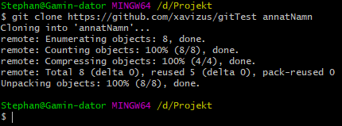

# **GIT**

## Vad är GIT?
Git är ett version hanteringssytstem som gör det enkelt att samarbeta i en grupp och att flera personer kan arbeta i en och samma fil.

## Varför använda sig av versionshantering
Orsaken till att man vill använda sig av versionhantering är främst att du själv inte behöver hålla koll och skapa massor av backup filer.

Du har säkerligen sett ett arbeta som kanske heter något liknande: **new.project**.

Du uppdaterar den och känner att du är klar. Så då sparar du den igen som **new.final.project**. Tillslut kommer du ha flera stycken filer och det är svårt att hålla koll på vilken fil som är den som är den senaste.

## Varför GIT?
Det är lätt använda så fort du har kommit över inlärningskurvan. Det krävs ingen central server. Det är vanligt andvänt i arbetsplatser.

## Installera GIT

Du installerar git på följande sätt:
-  Linux:   https://git-scm.com/downloads
-  Windows: https://gitforwindows.org/
-  Mac:     https://brew.sh (Eller: brew install git)


## Komma igång med GIT
Börja med att gå till din mapp där du har tänkt förvara dina projekt. I detta exemplet så har vi en mapp som ligger på följadne plat: **D:\Projekt**

Börja med att högerkliga i mappen, och sedan välj **Git Bash Here** \


En terminal dyker nu upp: \


Skapa nu en mapp via terminalen. Detta gör du genom att skriva följande:
- mkdir \<Namn>


Nu för att gå in i mappen du nyss skapa så använder du dig av kommandot:
- cd \<mappens namn> 

Ett tips är att börja skriva de första bokstäverna följt av en tabb, så skrivs det resterande in automagiskt.


När du väl är inne din önskade mapp, skriv in föjande:
- git init


När du initierar en repo, så skapas en mapp som heter .git som är vanligtvis osynligt i Windows. Allt som hör till git, sparas i mappen .git.

Vanligtvis så behöver du inte göra något i denna mapp.

## Konfigurera GIT

Det första du behöver göra för att kunna använda dig av git är att berätta vem du är:
````terminal
git config --global user.name "Stephan Ljungros"
git config --global user.email stephan.ljungros@gmail.com
````
Något viktigt du behöver veta är att den E-post adress som du anger ovan, måste vara detsamma som ditt konto du har/kommer att ha på GitHub

## Använda dig av GIT

Börja med att skriva in **git status**. Detta kommer ge dig informationen om den nuvarande statusen för din git repo.


Testa nu och skapa en fil. Du kan göra det genom Git bash med kommandot: **touch \<filnamn>**


Kör kommandot **git status** igen och se vad som händer. \


Nu informerar GIT att du har filer som inte är spårade. Det innebär att din repo inte håller reda på dessa filer. För att få GIT att hålla koll på filen, så skriver du in **git add \<filnamn>** eller så kan du också skriva **git add .** punkten innebär att den ska ta med alla filer som inte är spårade.

Något att hålla skillnad på, är att git add sparar inte ändringarna i GIT repon, utan den kollar nu bara om filen ändras.

För att kunna spara dina ändringar så behöver du använda dig av **commit**. Den sparar då dina ändringar. För att använda commit så behöver du också lägga till ett meddelande. Detta meddelande är till för att summera vad som din commit är tillför.
Du använder commit med följande kommando: **git commit -m "Meddelande"** \


## Remote GIT
Just nu så fungerar bara din GIT mot din egna dator. GIT fungerar som bäst när den finns på flera ställen. Men om den befinner sig på olika ställen så finns en risk att alla har olika versioner. Därför är det rekommenderat att ha en repo hos en leverantör eller en egen webbserver där man kan hosta repot ifrån. 

Några exempel på populära repo leverantörer:
- https://github.com 
- http://bitbucket.org
- https://gitlab.com

För att lägga till en extern repo, så kan du använda dig av följande kommnado **git remote origin \<URL>** \
Exempel: 


Notera att vi bara ladde till den externa repon, vi har inte skickat någon data från eller till. Men först måste vi se till att vi har fått in de ändringar som skett på den externa repon genom att skriva **git pull**


Notera nu att vi fick ett fel om att den inte förstod att våran lokala branch inte följer branchen på remote. Vi kan ange att den ska göra det genom att använda oss av följande kommando: **git branch --set-upstream-to=origin/master master**


Nu om vi försöker igen med **git pull**: \
 \
Ännu ett fel dyker upp, vilket säger att det finns orelaterade historier (changes), i båda repon, så en ihopslagning inte är möjlig. Detta kan du lösa genom att lägga till **--allow-unrelated-histories** på slutet av din **git pull**:
 \
Nu bör du ha fått upp en ruta om att du skall skriva in ett meddelande till varför mergen är nödvändigt. Du skriver in då ditt meddelande och sedan sparar och stänger filen.

Nu kommer du tillbaka till din Git Bash terminal, där den säger att den har gjort förändringar.


Nu har vi fått in filerna som fanns på remote repon. Om vi kollar statusen nu på vår lokala repo igen med **git status**


Nu informerar den att vi är före remote branchen med 2 commits. Vi kan nu ladda upp våra ändringar till den externa repon genom att skriva **git push**


Nu bör vår externa repo vara uppdaterad.

## Klona en repo
Oftast är det att du inte skapar en ny repo för ett projekt, utan det brukar oftast redan finnas en repo. Det enklaste sättet är då att klona repon. 
Innan du börjar klona repon så måste du gå till projekt mappen där du förvarar alla dina projekt (du ska inte skapa en ny projekt mapp utan endast navigera till mappen ovanför ditt förra projekt).


För att klona en repo så behöver du ta fram adressen som du ska klona ifårn. Exempelvis **https://github.com/xavizus/gitTest.git**

För att klona ovan adress så använder du kommandot clone: **git clone \<url>** \


Nu kommer du få en ny mapp som heter exakt så som det projekt du kopierade ifrån heter. I detta fall gitTest. 
Du har möjligheten att bestämma ett eget namn på GIT-mappen. Detta gör du genom att lägga till en extra fält i git clone kommandot: **git clone \<url> \<önskad namn>**
