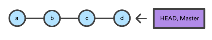
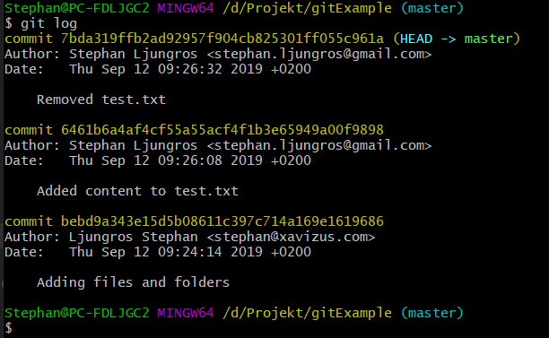
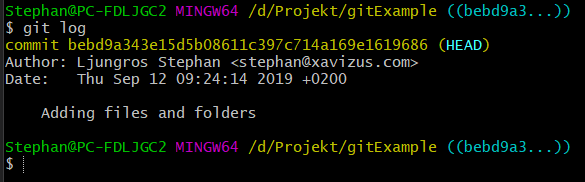
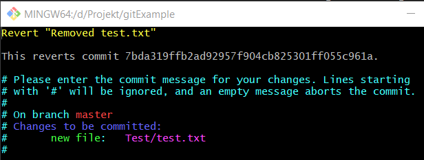
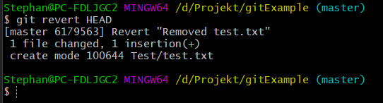
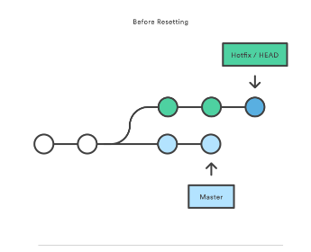
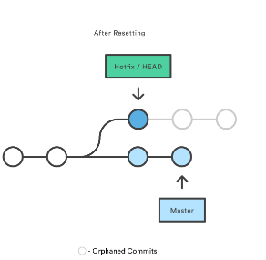
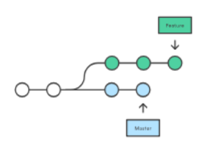
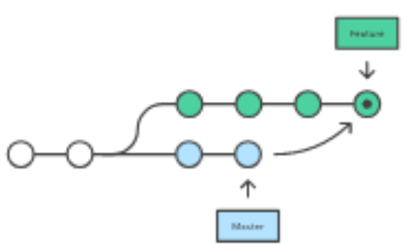

#Mer om GIT

## Från föregående GIT undervisning.

Vi har gått igenom följande funktioner i GIT:
- git init
- git clone
- git status
- git add
- git commit
- git push
- git pull
- git stash
- .gitignore (Används för att ignorera vissa filer)

## Brancher
Brancher ger oss möjligheten att arbeta parallelt med produktionskoden. Dvs. det kopierar koden till en "annan mapp".
Det är rekommenderat att hålla master branchen fri från test-koder.
Det är enkelt att använda sig av brancher.

Branch innehåller inte en kopia av koden utan en referens till en eller flera commits. dvs. enbart ändringr. En branch representerar en oberoende gren eller version av en utvecklingsfas, ex. en ny funktion till systemet.

Det mesta man behöver kunna göra med brancher, så använder man `git branch`

För att skapa en ny branch så skriver du `git branch <namn>` 

för att ta bort en branch, så skriver du `git branch -d <namn>`. Notera att du kan bara ta bort en branch så kan det bara gå att ta bort om du har gjort en master branch

För att tvinga en borttagning av en branch `git branch -D <namn>`

Du kan döpa om brancher genom `git branch -m <nyttnamn>`.

Du kan också lista alla brancher på ditt remote repo med `git branch -m`.

`git branch crazy-experiment` skapar en ny branch, vilket egentligen bara betyder att vi skapar en ny pekare till den commit vi är på just nu.

För att välja branchen och arbeta i den måste vi använda oss av `git checkout`. Sedan kan vi använda git som vanligt.

**Gör första uppgiften under exercises**

När man är klar med en branch vill man ofta slå ihop ändringarna med master branchen.
````
git checkout master
git merge crazy-exprement
````

Merge funktionen fungerar precis som tidigare.

**Gör andra uppgiften under exercises**

För att ta bort en branch `git branch -d crazy-experiment`

Om branchen inte är mergad med master så kommer du få ett felmeddelande. Om du verkligen vill ta bort en omergad branch `git branch -D crazy-experiment`. Detta tvingar borttaget av branchen. 

**Gör tredje uppgiften under exercises**

Notera att `git branch -d / -D <name>` tar bara bort den lokala branchen. Om du har en remote git, så behöver du köra följande för att ta bort branchen från remote `git push origin --delete crazy-experiment`

## Head
HEAD är en referens till den sista commit i den nuvarande branchen.

Du kan se HEAD som nuvarande branch . När man byter branch med checkout kommer HEAD att peka på toppen av den branch du bytte till.

Man kan se vad HEAD pekar på genom (i git bash) `cat .git/HEAD`

## Resetting, checking out, reverting

Man är inte låst till att bara checka ut brancher, utan du kan även checka ut specifika commits.

Det fins tre status-lägen i ett repo:
- Mappen(Som du arbetar i)
- Staging-area (filer tillagda med git add)
- commit-historiken

En checkout i bakgrunden flyttar egentligen HEAD ref-pekaren till en specifik commit. Tänk dig följande: I denna bild så pekar HEAD och master branchen på commit **d**.



Om du kör en `git checkout b` så kommer HEAD att peka mot **b**, dvs. det repot innehöll innan vi hade gjort commit **c**


Nu är det så att i GIT så heter inte commits a,b,c,d utan varje commit får ett unikt ID. (Kort sagt så är ID:t gernererat baserat på innehållet).

För att se dessa ID:n, så använder du dig av `git log`

I nedan exempel har vi tre commits: (Notera att senaste commiten är alltid längst uppe)


Om vi kollar på sista commiten, så finns det 4 rader:
- `commit 7bda319ffb2ad92957f904cb825301ff055c961a (HEAD -> master)` Vilket visar vilket ID commiten har.
- `Author: Stephan Ljungros <stephan.ljungros@gmail.com>` Visar vem som gjort commiten
- `Date:   Thu Sep 12 09:26:32 2019 +0200` Visar när commiten gjordes
- `Removed test.txt` är meddelandet användaren har skrivit i sitt message vid commiten.

För att kunna checka ut på en speciell commit så tar vi det ID vi vill checka ut på. Vi tar den första commiten vi gjorde som exempel
`git checkout bebd9a343e15d5b08611c397c714a169e1619686`

Nu får du ett meddelande

````
Note: switching to 'bebd9a343e15d5b08611c397c714a169e1619686'.

You are in 'detached HEAD' state. You can look around, make experimental
changes and commit them, and you can discard any commits you make in this
state without impacting any branches by switching back to a branch.

If you want to create a new branch to retain commits you create, you may
do so (now or later) by using -c with the switch command. Example:

  git switch -c <new-branch-name>

Or undo this operation with:

  git switch -

Turn off this advice by setting config variable advice.detachedHead to false

HEAD is now at bebd9a3 Adding files and folder
````

Nu är du i din första commit. Så om vi kör en `git log` nu så kommer du inte se dina tidigare commits:


I git gör man inte om gamla versioner, men man kan checka ut dem och "ångra" ändringarna till en ny commit.

En revert innebär att man tar en  specifik commit och skapar en ny commit som tar bort alla ändringar i den första commiten. Den nya commiten skapas automatiskt.

`git revert` tar en commit som parameter, den commit man vill ångra. Man anger hashen för commiten man vill ångra. Om det är den senaste commiten du vill ångra, så kan du ange HEAD.

Så nu vill du ångra att du tog bort filen, det gör du genom `git revert HEAD`

Nu får du upp en ruta om att du behöver skriva in ett meddelande om reverten.


Efter att du har skrivit in ditt meddelande, så klickar du på colon (**:**), och skriver **wq** och sen enter.

Nu får du meddelande om att en commit på revert är utförd. Vilket är i detta fall, återskapande av en fil vid namnet test.txt


**Gör fjärde uppgiften under exercises**

## Reset
En reset är en operation som tar en specifik commit och resettar statusen för de tre statuslägen i repot. Dvs. filer vi inte har commitat, men har stagat (med hjälp av `add`).

Man kan göra reset på alla tre statuslägen.

Att resetta en specifik commit gör du genom kommandot `git reset <commitID>`. Om du vet hur många commits det var sen senaste commiten så kan du skriva `git reset HEAD~2`. Det återställer till din repo till commiten för 2 steg sedan.

Man använder den oftast för att ångra ändringar man inte har delat med någon t.ex. om man vill börja om på en branch.

Exempel hur det ser ut före en reset.


Exempel hur det ser ut efter en reset


`git reset` tar emot tre olika kommandon:
- `--soft` Innebär att den behåller filerna från den nuvarande commiten som då är stagade. Dvs. om vi utför commiten nu, så kommer det bli exat som det var i den commit vi flyttar ifrån.
- `--mixed` Staging-areans snapshot uppdateras för att matcha den specificerade committen men working directory ändras inte. (Detta är default.)
- `--hard` alla ändringar du gör återställs till den commit du har valt.

- Varför vill man inte restta kod man har delat med någon annan?
- Vad kan tänkas vara en bättre strategi av det vi har tittat på och varför? 
  - Det är bättre att göra en ny branch.

**Gör femte uppgiften under exercises**

## Merge och rebase

Merge och rebase löser samma probelm, dock på två olika sätt.

Säg att du arbetar med en feture bransh och någon uppdaterar Master branchen med ändringar som är relevanta för din branch, så kan du ta hjälp av rebase.



Vid Merge:
`git checkout feature` följt av `git merge master`, eller kortare `git merge feature master`



Detta betyder att den existerande branchen inte ändras (Feature). Dock betyder det att vi behöver göra en extra merge från master varje gång vi vill lägga till nya ändringar.

Vid Rebase:
`git checkout feature` följt av `git rebase master`.
Detta flyttar feature-branchen till att börja ovanpå Master branchen. Så istället för att göra en merge-commit, så skriver rebase om hela projekt historiken för varje commit i orginal branchen.

Den stora fördelen med rebase är en snyggare historik. Den tar bort ”onödiga” merge-committar och gör det lättare att följa historiken.

Det negativa är att man tar bort säkerhet och spårbarhet. (Hur tar man bort säkerhet? Varför vill man ha kvar committs?)

**Golden rule of Rebase**
Det viktigaste är när man inte ska göra rebase; på publika brancher.

Rebase flyttar alla commits i master ovanpå future-branchen, men bara i ditt repo. Alla andra jobbar fortfarande mot orginal-master

Eftersom rebase resulterar i helt nya, omskrivna commits kommer git att tro att din Master har gått ifrån ("diverged") från alla andras repo.

## Git log
Git log skriver ut alla våra commits

Kommando:
- `--oneline` visar allt i förkortat läge
- `--stat` visar en sammanfattning av borttagningar och tillägg i varje fil
- ``
- `-p` visar faktiskta ändrignar i koden.
- `--shortlog` visar v
- `git log --graph --oneline --decorate` visar en lite grafiskt vy vad som har hänt med brancher.

Det går att filtrera
- `git log -3` 3 sensate commits
- På datum `git log --after="2014-7-1" --before="2014-7-4"`, eller `git log --after="yesterday"`
- Söka på meddelanden `git log --grep="JRA-224:`
- Visa loggar på specifik fil `git log -- foo.py bar.py`
- På innehåll `git log -S"Hello Word"`, `git log -G"<regex>"`